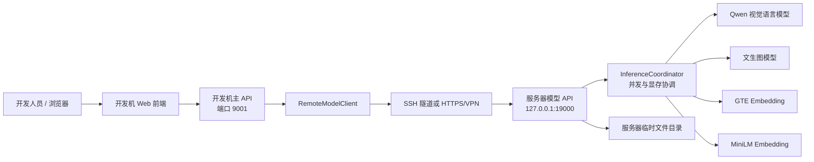
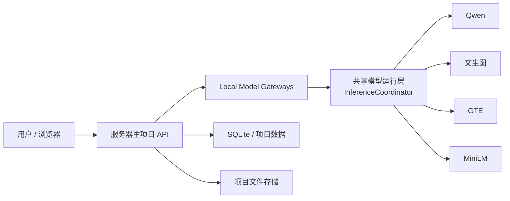

# 服务器端模型部署以及与开发机端项目连接的实施方案

> 适用项目：`deep_sea_explorer`  
> 文档日期：2026-07-23  
> 目标读者：编程开发新手、后续执行任务的 AI Coding 工具  
> 当前状态：实施方案，尚未代表服务器模型已经部署完成

---

## 0. 文档目标与重要结论

本方案用于完成两种运行方式：

1. **开发测试阶段**：项目运行在开发机上，Qwen、文生图、GTE、MiniLM 等模型全部运行在服务器上。开发机通过受保护的网络连接调用服务器模型服务。
2. **正式部署阶段**：项目代码与模型都部署在同一台服务器上，项目使用 `MODEL_BACKEND=local`，直接调用服务器本机的模型运行层，不再绕行远程 HTTP 接口。

推荐的整体做法是：

- 先统一开发机和服务器之间的 API 契约。
- 再实现一套可复用的本地模型运行层。
- 服务器模型 API 和正式部署时的主项目共同复用这套运行层。
- 开发阶段优先通过 **SSH 隧道**访问模型服务，不把模型端口直接暴露到公网。
- 未确认服务器硬件、操作系统、模型文件和显存占用前，不提前固定 PyTorch/CUDA 版本，也不承诺某个模型一定能够运行。

### 0.1 当前代码现状

根据当前项目代码，可以确认：

- 项目已经具有 `remote`、`local`、`fake` 三类模型后端的结构。
- 开发环境示例配置默认使用 `remote`，但模型服务默认关闭。
- 服务器环境示例配置默认使用 `local`。
- 远程模型客户端已有基本框架。
- `docs/server-model-api-contract.md` 已有一份 API 契约草案。
- 本地模型网关目前仍有占位实现，实际模型推理尚未完成。
- 真实远程模型集成测试目前仍是占位测试。

因此，**当前项目还不能直接完成真实服务器模型联调**。必须先完成本方案中的契约统一、服务器模型运行层、模型 API、客户端修正和集成测试。

### 0.2 当前必须先解决的不一致

| 项目 | 契约草案 | 当前客户端代码 | 本方案建议 |
| --- | --- | --- | --- |
| 视频上传字段 | `video` | `file` | 统一为 `video` |
| 图片上传字段 | `image` | `file` | 统一为 `image` |
| 文生图路径 | `/v1/images/generate` | `/v1/image/generate` | 统一为复数 `/v1/images/generate` |
| Embedding 模型标识 | `memo`、`rag` | `gte`、`minilm` | 对外统一为 `memo`、`rag` |
| 图像评估返回 | `decision` 对象 | 客户端读取顶层字段 | 统一为 `decision` 对象 |
| 问答中的问题 | 普通表单字段 `question` | 模拟成文本文件 | 统一为普通表单字段 |
| 流式问答 | NDJSON 流 | 先接收完整响应再切行 | 实现真正的流式读取 |
| 请求追踪 | `X-Request-ID` | 尚未完整实现 | 客户端和服务端都实现 |
| 本地模型调用 | 应执行真实推理 | 当前主动抛出未实现异常 | 完成本地运行层 |

在这些问题解决前，不应把服务器模型服务判定为“已完成”。

---

## 1. 范围、假设与暂不处理的内容

### 1.1 本方案覆盖

- 服务器环境检查。
- 模型文件准备与目录规划。
- Python、PyTorch 和模型依赖环境。
- Qwen 视觉语言模型服务。
- 文生图模型服务。
- GTE 与 MiniLM 向量服务。
- 模型 API 的鉴权、错误处理、流式返回和请求追踪。
- 开发机通过 SSH 隧道或 HTTPS 连接服务器。
- 开发机项目的远程模型联调。
- 正式部署后切换为服务器本地模型。
- 自动化测试、验收、监控与回滚。

### 1.2 本方案使用的命令假设

服务器命令主要按以下环境编写：

- Ubuntu 或兼容的 Linux。
- NVIDIA GPU。
- 能够使用 Conda。
- 使用 `systemd` 管理服务。
- 开发机为 Windows PowerShell。

如果实际服务器不是上述环境，例如 Windows Server、纯 CPU、AMD GPU、容器平台或 Kubernetes，**不要机械复制命令**，应先根据实际环境调整本方案。

### 1.3 目前无法仅通过当前代码确认

以下信息需要项目负责人或服务器管理员在实施时补充：

- 服务器地址、SSH 端口、登录账号和网络策略。
- 服务器操作系统及版本。
- GPU 型号、数量、显存、驱动版本和磁盘容量。
- 是否允许服务器访问 Hugging Face、ModelScope 或其他模型来源。
- Qwen、文生图、GTE、MiniLM 的准确模型名称、版本和许可证。
- 模型文件当前是否已经下载。
- 模型推理精度，例如 FP32、FP16、BF16、INT8 或 INT4。
- 文生图模型的实际请求参数与安全策略。
- 可接受的响应时间、并发量和最长视频时长。
- 是否需要域名、HTTPS 证书、VPN、堡垒机或内网访问。
- 最终服务器是否只运行本项目，还是同时承载其他服务。

这些内容没有确认前，只能使用本文的占位符和通用方案。

---

## 2. 目标架构

### 2.1 开发测试阶段

开发机只运行项目本身和前端页面，所有模型推理均由服务器完成。



### 2.2 正式部署阶段

项目代码部署到服务器后，主项目直接调用服务器本机的模型运行层。



### 2.3 为什么要共享模型运行层

服务器模型 API 和正式部署的主项目都需要调用相同模型。如果分别实现两套推理代码，会造成：

- 开发联调通过，但正式部署结果不同。
- 两套代码的参数和错误处理逐渐不一致。
- 模型升级时需要重复修改。
- 显存和并发问题难以统一管理。

因此建议：

- 实际加载模型和执行推理的代码放在项目本地模型基础设施层。
- 开发阶段的服务器模型 API 只是这套运行层的 HTTP 包装。
- 正式部署时，主项目的 `local` 网关直接调用同一套运行层。

建议的目标目录如下，具体文件名可在实施时微调：

```text
src/deep_sea_explorer/
├─ infrastructure/
│  └─ models/
│     ├─ local/
│     │  ├─ qwen_vl.py
│     │  ├─ image_generation.py
│     │  ├─ sentence_embedding.py
│     │  ├─ coordinator.py
│     │  └─ gateways.py
│     └─ remote/
│        ├─ client.py
│        ├─ vision.py
│        ├─ image.py
│        └─ embedding.py
└─ model_service/
   ├─ app_factory.py
   ├─ config.py
   ├─ auth.py
   ├─ errors.py
   └─ routes/
      ├─ health.py
      ├─ vision.py
      ├─ images.py
      └─ embeddings.py
```

---

## 3. 实施路线总览

必须按顺序执行，尤其不能跳过“契约冻结”和“单模型冒烟测试”。

| 阶段 | 名称 | 主要产物 | 完成标志 |
| --- | --- | --- | --- |
| S0 | 准备实施记录 | 参数清单、负责人、变更记录 | 所有未知项有负责人 |
| S1 | 服务器环境盘点 | 环境基线文档 | GPU、驱动、磁盘、网络已确认 |
| S2 | 冻结 API 契约 | 正式 API 契约、契约测试 | 客户端与服务端约定完全一致 |
| S3 | 网络与安全设计 | SSH 隧道或 HTTPS 方案 | 模型端口未裸露公网 |
| S4 | 服务器目录与账号 | 服务账号、目录、权限 | 非 root 账号可读模型、可写临时目录 |
| S5 | Python 与 GPU 环境 | Conda 环境、依赖锁定文件 | PyTorch 能识别 GPU |
| S6 | 模型文件准备 | 四类模型的版本与路径记录 | 模型文件完整、许可证明确 |
| S7 | 单模型冒烟测试 | 四类独立测试结果 | 每个模型可独立推理 |
| S8 | 共享模型运行层 | 本地模型实现 | 不通过 HTTP 也能调用模型 |
| S9 | 服务器模型 API | 可启动的模型服务 | 所有 `/v1` 接口可调用 |
| S10 | 自动化测试 | 单元、契约、集成测试 | 假模型测试稳定，真模型测试通过 |
| S11 | 开发机联调 | `.env`、SSH 隧道、联调记录 | 开发机全流程使用服务器模型 |
| S12 | 服务托管与监控 | systemd、日志、健康检查 | 重启服务器后服务可恢复 |
| S13 | 正式部署切换 | `MODEL_BACKEND=local` | 主项目直接调用本机模型 |
| S14 | 验收与回滚 | 验收报告、回滚手册 | 所有验收项通过并可回退 |

---

## 4. S0：建立实施记录

### 4.1 要做什么

在正式修改代码前，建立一份实施参数表。建议后续创建：

```text
docs/server-model-deployment-record.md
```

本文只是方案，不应在这一阶段把尚未确认的数据写死到代码里。

### 4.2 参数表模板

| 参数 | 示例占位符 | 实际值 | 负责人 | 状态 |
| --- | --- | --- | --- | --- |
| 服务器地址 | `{SERVER_HOST}` | 待填写 | 服务器管理员 | 未确认 |
| SSH 账号 | `{SERVER_USER}` | 待填写 | 服务器管理员 | 未确认 |
| SSH 端口 | `{SSH_PORT}` | 待填写 | 服务器管理员 | 未确认 |
| 模型服务端口 | `19000` | 待确认 | 开发负责人 | 未确认 |
| GPU | `{GPU_MODEL}` | 待填写 | 服务器管理员 | 未确认 |
| Qwen 模型 | `{QWEN_MODEL_ID}` | 待填写 | 算法负责人 | 未确认 |
| 文生图模型 | `{IMAGE_MODEL_ID}` | 待填写 | 算法负责人 | 未确认 |
| GTE 模型 | `{GTE_MODEL_ID}` | 待填写 | 算法负责人 | 未确认 |
| MiniLM 模型 | `{MINILM_MODEL_ID}` | 待填写 | 算法负责人 | 未确认 |
| 最大视频大小 | `{MAX_VIDEO_MB}` | 待确认 | 产品/开发 | 未确认 |
| 最大并发 | `{MAX_INFERENCE_CONCURRENCY}` | 待压测 | 开发负责人 | 未确认 |

### 4.3 为什么做

新手最容易把示例地址、临时模型名或测试 Token 当成正式值提交。参数表把“代码事实”和“等待确认的部署参数”分开。

### 4.4 完成标准

- 每一个未知项都有负责人。
- 未确认值仍保持占位符，不写成看似真实的默认值。
- 密钥、Token 不写入 Markdown、不提交 Git。

---

## 5. S1：盘点服务器环境

### 5.1 登录服务器

在开发机 PowerShell 中执行：

```powershell
ssh -p {SSH_PORT} {SERVER_USER}@{SERVER_HOST}
```

将大括号内容替换为实际值，不要保留大括号。

### 5.2 在服务器执行只读检查

```bash
uname -a
cat /etc/os-release
python3 --version
conda --version
nvidia-smi
nvidia-smi --query-gpu=name,memory.total,driver_version --format=csv,noheader
df -h
free -h
ffmpeg -version
```

如果 `nvcc` 已安装，可额外执行：

```bash
nvcc --version
```

`nvcc` 不存在不一定代表 PyTorch 无法使用 GPU。关键是 NVIDIA 驱动正常，且后续安装的 PyTorch 与运行环境兼容。

### 5.3 记录什么

- 系统名称和版本。
- GPU 名称、数量和显存。
- NVIDIA 驱动版本。
- 可用内存和磁盘。
- Python、Conda、FFmpeg 是否存在。
- 模型目录所在磁盘的可用空间。
- 服务器能否访问模型下载源和 Python 包源。
- 是否必须使用代理或内网镜像。

### 5.4 完成标准

- `nvidia-smi` 能正常显示 GPU；如果计划纯 CPU 运行，则已明确接受性能影响。
- 模型和临时文件准备放在哪个磁盘已经确定。
- Python 版本计划为 3.11，符合当前项目 `>=3.11,<3.13` 的要求。
- 网络限制和代理要求已记录。

### 5.5 停止条件

出现以下任何情况，应暂停后续部署：

- `nvidia-smi` 失败。
- GPU 正被其他重要任务长期占用。
- 磁盘不足以存放模型、缓存和临时视频。
- 无法确认模型许可证或下载权限。
- 服务器管理员不允许开启所需进程或端口。

不要通过盲目升级驱动、删除其他模型或清理未知目录来“快速解决”。

---

## 6. S2：冻结服务器模型 API 契约

### 6.1 要做什么

先修改并定稿现有的：

```text
docs/server-model-api-contract.md
```

然后依据契约同步修改：

- 远程客户端。
- 服务器模型 API。
- 假服务和测试夹具。
- 开发机联调测试。

### 6.2 推荐的最终接口

基础地址：

```text
http://127.0.0.1:19000
```

API 前缀：

```text
/v1
```

| 方法 | 路径 | 请求 | 响应 |
| --- | --- | --- | --- |
| GET | `/v1/health` | 无业务参数 | 服务和各模型状态 |
| POST | `/v1/vision/describe-video` | `multipart/form-data`，字段 `video` | JSON，视频描述文本 |
| POST | `/v1/vision/evaluate-frame` | `multipart/form-data`，字段 `image` | JSON，`decision` 对象 |
| POST | `/v1/vision/answer` | `video` 文件、`question` 普通表单字段 | NDJSON 流 |
| POST | `/v1/vision/summarize-report` | JSON，字段 `material` | JSON，报告摘要 |
| POST | `/v1/images/generate` | JSON，提示词和生成参数 | JPEG 二进制 |
| POST | `/v1/embeddings` | JSON，`model` 和 `texts` | JSON，向量数组 |

### 6.3 通用请求头

```http
Authorization: Bearer {MODEL_SERVICE_AUTH_TOKEN}
X-Model-API-Version: 1
X-Request-ID: {UUID}
```

规则：

- 客户端应生成 `X-Request-ID`。
- 服务端收到后沿用该 ID；没有收到时由服务端生成。
- 服务端响应也返回 `X-Request-ID`。
- 日志通过 Request ID 串联，但不记录 Token、原始视频和完整用户隐私数据。

### 6.4 推荐响应示例

健康检查：

```json
{
  "status": "ok",
  "models": {
    "qwen": "not_loaded",
    "image": "not_loaded",
    "memo": "not_loaded",
    "rag": "not_loaded"
  }
}
```

视频描述：

```json
{
  "request_id": "7ab6...",
  "text": "视频中展示了……"
}
```

图像评估：

```json
{
  "request_id": "7ab6...",
  "decision": {
    "accepted": true,
    "score": 0.92,
    "reason": "画面清晰且符合要求"
  }
}
```

Embedding：

```json
{
  "request_id": "7ab6...",
  "model": "memo",
  "normalized": true,
  "dimension": 1024,
  "embeddings": [
    [0.01, -0.02]
  ]
}
```

`dimension` 的实际值由所选模型决定，不应提前写死。

统一错误：

```json
{
  "request_id": "7ab6...",
  "error": {
    "code": "INVALID_INPUT",
    "message": "video 字段缺失"
  }
}
```

### 6.5 流式问答规范

响应类型：

```http
Content-Type: application/x-ndjson
```

每一行是一个完整 JSON 对象：

```json
{"type":"delta","text":"这是"}
{"type":"delta","text":"回答"}
{"type":"done","usage":{"output_chars":4}}
```

出错时：

```json
{"type":"error","code":"MODEL_FAILURE","message":"模型推理失败"}
```

客户端必须逐块读取网络流，不可在完整响应结束后才按换行拆分。

### 6.6 状态码

| 状态码 | 用途 |
| --- | --- |
| 200 | 请求成功 |
| 400 | 请求格式错误 |
| 401 | Token 缺失或无效 |
| 413 | 上传内容过大 |
| 415 | 文件类型不支持 |
| 422 | 参数存在但无法处理 |
| 429 | 推理队列已满 |
| 500 | 未预期的服务端错误 |
| 503 | 模型未就绪或 GPU 不可用 |
| 504 | 推理超时 |

### 6.7 完成标准

- 契约文档不再标记为 `DRAFT`。
- 每个接口都有请求、响应和错误示例。
- 客户端与服务端测试都使用同一套字段名。
- 当前代码中第 0.2 节列出的不一致全部消除。

---

## 7. S3：确定网络与安全方案

### 7.1 开发阶段推荐：SSH 隧道

服务器模型服务只监听：

```text
127.0.0.1:19000
```

开发机 PowerShell 建立隧道：

```powershell
ssh -N -L 19000:127.0.0.1:19000 -p {SSH_PORT} {SERVER_USER}@{SERVER_HOST}
```

保持此终端窗口运行。开发机访问：

```text
http://127.0.0.1:19000
```

实际流量会通过 SSH 到服务器本机的 19000 端口。

### 7.2 为什么推荐 SSH 隧道

- 不需要立即申请公网域名和证书。
- 模型端口无需对公网开放。
- SSH 自带加密。
- 适合早期单人或小团队联调。

即使使用 SSH 隧道，也保留 Bearer Token，以防服务器上其他本地进程误调用。

### 7.3 生成模型服务 Token

在服务器上执行：

```bash
python3 -c "import secrets; print(secrets.token_urlsafe(48))"
```

将结果放入仅服务账号可读的环境文件，例如：

```text
/etc/deep-sea-explorer/model-service.env
```

设置权限：

```bash
sudo chown deepsea:deepsea /etc/deep-sea-explorer/model-service.env
sudo chmod 600 /etc/deep-sea-explorer/model-service.env
```

不要：

- 把 Token 写入本文。
- 把 Token 提交 Git。
- 在聊天、截图或测试日志中展示完整 Token。
- 在命令行中长期直接粘贴 Token。

### 7.4 多人或长期使用：HTTPS/VPN

如果后续需要多人持续访问，应选择：

- 公司 VPN 或私有网络。
- 反向代理，例如 Nginx。
- 有效 HTTPS 证书。
- 防火墙只允许可信网段。
- Token 定期轮换。

使用 HTTPS 时，开发机配置：

```dotenv
MODEL_SERVICE_BASE_URL=https://models.example.com
MODEL_SERVICE_VERIFY_TLS=true
```

不要通过设置 `VERIFY_TLS=false` 绕过无效证书。只有使用本机 SSH 隧道和 `http://127.0.0.1` 时才不涉及 TLS 校验。

### 7.5 完成标准

- 开发阶段选定 SSH 隧道或 HTTPS/VPN。
- 模型服务端口没有直接暴露到公网。
- Token 已生成并安全保存。
- 已明确谁负责管理 SSH 权限、证书和 Token 轮换。

---

## 8. S4：创建服务器账号和目录

### 8.1 推荐目录

```text
/opt/deep-sea-explorer/
├─ app/                 # 项目代码
├─ models/
│  ├─ qwen/
│  ├─ image/
│  ├─ gte/
│  └─ minilm/
├─ data/
│  └─ tmp/              # 上传文件和处理中间文件
└─ logs/

/etc/deep-sea-explorer/
├─ model-service.env
└─ app.env
```

### 8.2 创建专用账号

以下命令需要服务器管理员确认后执行：

```bash
sudo useradd --system --create-home --shell /bin/bash deepsea
sudo mkdir -p /opt/deep-sea-explorer/app
sudo mkdir -p /opt/deep-sea-explorer/models/qwen
sudo mkdir -p /opt/deep-sea-explorer/models/image
sudo mkdir -p /opt/deep-sea-explorer/models/gte
sudo mkdir -p /opt/deep-sea-explorer/models/minilm
sudo mkdir -p /opt/deep-sea-explorer/data/tmp
sudo mkdir -p /opt/deep-sea-explorer/logs
sudo mkdir -p /etc/deep-sea-explorer
sudo chown -R deepsea:deepsea /opt/deep-sea-explorer
sudo chmod 750 /etc/deep-sea-explorer
```

如果公司已有统一服务账号规范，使用公司规范，不要重复创建账号。

### 8.3 权限原则

- 模型文件：服务账号只需读取。
- 临时目录：服务账号需要读写和删除。
- 环境文件：仅服务账号和管理员可读。
- 不使用 `chmod 777`。
- 不以 root 身份运行模型服务。
- 模型文件、上传文件和生成图片均不提交 Git。

### 8.4 完成标准

使用服务账号确认：

```bash
sudo -u deepsea test -r /opt/deep-sea-explorer/models
sudo -u deepsea test -w /opt/deep-sea-explorer/data/tmp
```

命令退出且不报错，代表最基本权限正确。

---

## 9. S5：创建 Python 与 GPU 运行环境

### 9.1 创建 Conda 环境

```bash
conda create -n deep-sea-model-service python=3.11 -y
conda activate deep-sea-model-service
python --version
python -m pip install --upgrade pip
```

完成后应显示 Python 3.11.x。

### 9.2 安装 PyTorch

不要直接复制网上随机命令，也不要根据 CUDA 名称猜版本。

操作步骤：

1. 打开 PyTorch 官方安装选择器：  
   <https://docs.pytorch.org/get-started/locally/>
2. 根据服务器操作系统、包管理器、Python 和 GPU 运行环境选择命令。
3. 把生成的命令记录到部署记录中。
4. 在 Conda 环境内执行。

命令占位形式：

```bash
{PYTORCH_INSTALL_COMMAND_FROM_OFFICIAL_SELECTOR}
```

### 9.3 验证 PyTorch

```bash
python -c "import torch; print('torch=', torch.__version__); print('cuda=', torch.cuda.is_available()); print('device=', torch.cuda.get_device_name(0) if torch.cuda.is_available() else 'CPU')"
```

GPU 部署的完成标准：

- `cuda=True`。
- 显示的 GPU 与 `nvidia-smi` 一致。
- 没有驱动不兼容错误。

### 9.4 安装项目模型依赖

当前项目的模型依赖仍需要在实施时补全和锁定。建议在 `pyproject.toml` 中建立独立依赖组，例如：

```text
server-model
```

至少需要依据实际模型确认：

- `torch`
- `transformers`
- `accelerate`
- `sentence-transformers`
- `diffusers`
- 文生图模型所需的调度器或加速库
- 视频/图像处理库
- 生产 WSGI 服务，例如 `gunicorn`

先在独立分支完成依赖定义，再安装：

```bash
python -m pip install -e ".[server-model,dev]"
```

不要在尚未验证兼容性时随意固定版本。完成实际模型验证后，再生成可复现的锁定记录，例如：

```bash
python -m pip freeze > docs/server-requirements-lock.txt
```

锁定文件应经过代码评审，避免把本机无关包全部当成项目依赖。

### 9.5 完成标准

- Python 版本符合项目要求。
- PyTorch 能识别 GPU。
- 所有模型依赖能导入。
- 已记录实际安装版本。
- 重新创建环境时有明确步骤。

---

## 10. S6：准备模型文件

### 10.1 必须先确认模型清单

为每个模型记录：

| 用途 | 对外标识 | 实际模型名称 | 版本/提交号 | 本地目录 | 许可证 |
| --- | --- | --- | --- | --- | --- |
| 视频理解与问答 | `qwen` | 待确认 | 待确认 | `/opt/deep-sea-explorer/models/qwen` | 待确认 |
| 文生图 | `image` | 待确认 | 待确认 | `/opt/deep-sea-explorer/models/image` | 待确认 |
| 备忘录语义向量 | `memo` | GTE，具体型号待确认 | 待确认 | `/opt/deep-sea-explorer/models/gte` | 待确认 |
| RAG 语义向量 | `rag` | MiniLM，具体型号待确认 | 待确认 | `/opt/deep-sea-explorer/models/minilm` | 待确认 |

对外标识保持稳定，实际模型可以在配置中更换。

### 10.2 模型文件要求

- 固定模型版本或仓库提交号，避免自动得到不兼容的新版本。
- 核对配置文件、Tokenizer、权重分片和必要预处理文件。
- 记录模型来源和许可证。
- 生产启动时优先只读本地文件，不在启动过程中自动联网下载。
- 模型缓存目录要固定，不要依赖某个管理员个人主目录。

### 10.3 环境变量示例

服务器模型 API：

```dotenv
MODEL_BACKEND=local
MODEL_SERVICE_HOST=127.0.0.1
MODEL_SERVICE_PORT=19000
MODEL_SERVICE_AUTH_TOKEN={GENERATED_SECRET}

QWEN_MODEL_PATH=/opt/deep-sea-explorer/models/qwen
IMAGE_MODEL_PATH=/opt/deep-sea-explorer/models/image
GTE_MODEL_PATH=/opt/deep-sea-explorer/models/gte
MINILM_MODEL_PATH=/opt/deep-sea-explorer/models/minilm
MODEL_TEMP_DIR=/opt/deep-sea-explorer/data/tmp

MODEL_LOCAL_FILES_ONLY=true
MODEL_MAX_QUEUE_SIZE=4
MODEL_INFERENCE_TIMEOUT_SECONDS=120
```

变量名应与实施后的设置类保持一致。上例中尚未存在的变量需要在实施时加入配置代码和示例环境文件。

### 10.4 完成标准

- 四类模型的准确名称和版本都已记录。
- 模型目录中所需文件完整。
- 服务账号能读取模型文件。
- 启动模型时不会意外从互联网下载最新版。
- 许可证允许当前项目用途。

---

## 11. S7：逐个执行单模型冒烟测试

### 11.1 为什么必须逐个测试

如果一开始同时加载四个模型，出错时难以判断是：

- 模型文件不完整。
- 依赖版本不兼容。
- 显存不足。
- 视频解码失败。
- 模型本身不支持当前调用方式。

逐个测试还能测量每个模型的显存和时间，为并发策略提供依据。

### 11.2 建议增加的测试脚本

后续实施时创建：

```text
scripts/server/check_gpu.py
scripts/server/smoke_qwen.py
scripts/server/smoke_image_generation.py
scripts/server/smoke_gte.py
scripts/server/smoke_minilm.py
```

脚本要求：

- 模型路径从环境变量读取。
- 不写入真实业务数据库。
- 使用小型、无敏感信息的测试素材。
- 打印模型加载时间、推理时间和显存使用。
- 失败时返回非零退出码。
- 不输出密钥或完整模型内部路径到公共日志。

### 11.3 Qwen 测试

至少验证：

- 模型和处理器可加载。
- 一张测试图片能够生成描述。
- 一个短测试视频能够生成描述。
- 对短视频提问能生成答案。
- 文本材料能生成报告摘要。
- 返回文本为有效 UTF-8。

模型调用方式必须以选定 Qwen 模型的官方文档为准。Qwen3-VL 的 Transformers 文档可参考：  
<https://huggingface.co/docs/transformers/main/model_doc/qwen3_vl>

注意：官方 `main` 文档可能对应开发版库。实施时要核对已安装的稳定版文档和所选模型版本，不要盲目从源码安装最新 Transformers。

### 11.4 文生图测试

至少验证：

- 模型能加载。
- 固定随机种子能够生成一张小尺寸图片。
- 输出可以编码为 JPEG。
- 非法尺寸、过长提示词会被拒绝。
- 生成过程中不会把中间图片写入不受控目录。

Diffusers 官方 Pipeline 文档：  
<https://huggingface.co/docs/diffusers/api/pipelines/overview>

具体使用 `DiffusionPipeline` 还是模型专用 Pipeline，以实际模型兼容性为准。

### 11.5 GTE 和 MiniLM 测试

每个模型至少验证：

- 输入两段文本，返回两个向量。
- 向量维度一致。
- 所有值是有限数字。
- 归一化策略明确。
- 同一输入重复执行，在允许误差内结果一致。

Sentence Transformers 官方用法：  
<https://sbert.net/docs/sentence_transformer/usage/usage.html>

SentenceTransformer 接口：  
<https://sbert.net/docs/package_reference/sentence_transformer/model.html>

如果模型区分查询与文档编码，应明确何时使用 query/document 专用方法；不要假设所有模型都使用同一种 Prompt。

### 11.6 记录资源

测试每个模型前后执行：

```bash
nvidia-smi
```

记录：

- 加载前显存。
- 加载后显存。
- 单次推理峰值显存。
- 推理时间。
- 输入大小。
- 使用的精度。

### 11.7 完成标准

- 四类模型均能独立完成最小推理。
- 每个模型的模型版本、精度、显存和耗时已记录。
- 如果无法同时驻留，已决定“按需加载/卸载”或“拆分 GPU/进程”策略。
- 尚未通过冒烟测试的模型不会接入 API。

---

## 12. S8：实现共享模型运行层

### 12.1 目标

实现真实的本地模型调用，替换当前 `local` 网关中的占位异常。

### 12.2 分层职责

#### 模型适配器

每种模型一个适配器，负责：

- 从配置路径加载模型。
- 预处理输入。
- 执行推理。
- 将模型原始输出转换成项目需要的结果。
- 释放临时 GPU 张量。

#### `InferenceCoordinator`

负责：

- 控制同时进入 GPU 的任务数量。
- 对队列长度进行限制。
- 记录模型加载状态。
- 防止多个线程重复加载同一模型。
- 在超时、显存不足时转换为可识别错误。
- 根据测量结果决定是否允许模型同时驻留。

#### Local Gateways

负责：

- 实现当前领域层定义的模型网关接口。
- 把业务输入转换给模型适配器。
- 返回领域对象。
- 不包含 HTTP、Flask 或远程鉴权逻辑。

### 12.3 并发原则

初始版本建议：

- 推理并发从 1 开始。
- 队列设置为有限长度，例如 4，实际值通过压测决定。
- 队列满时返回 429，不允许无限等待。
- 不使用多个 Gunicorn worker 复制加载 GPU 模型。

“单 worker”是根据 GPU 模型通常会在每个进程中分别占用显存作出的项目部署判断，最终仍需结合实际模型和 GPU 压测。

### 12.4 错误类型

运行层至少区分：

- `ModelNotConfigured`
- `ModelLoadFailure`
- `InvalidModelInput`
- `InferenceTimeout`
- `InferenceQueueFull`
- `GpuOutOfMemory`
- `ModelOutputInvalid`

上层 API 再把它们映射为稳定的状态码和错误码。

### 12.5 测试要求

- 使用假适配器测试协调器，不要求 CI 有 GPU。
- 验证同时请求不会重复加载。
- 验证队列满时快速失败。
- 验证异常后锁能够释放。
- 验证临时文件最终删除。
- 真模型测试通过显式环境变量开启，不作为普通开发机测试的默认前提。

### 12.6 完成标准

- 不启动 HTTP 服务，也能通过 Python 调用四类模型能力。
- 当前本地网关不再抛出“等待服务器验证”的占位异常。
- 普通 CI 可以使用假模型运行测试。
- 真实模型冒烟测试只在指定服务器执行。

---

## 13. S9：实现服务器模型 API

### 13.1 应用结构

模型服务使用独立应用工厂，至少包括：

- 配置加载与校验。
- Bearer Token 鉴权。
- Request ID。
- 请求大小限制。
- 统一错误响应。
- 临时文件保存和清理。
- 模型路由。
- 健康检查。
- NDJSON 流式响应。

### 13.2 上传文件处理

必须做到：

- 只接收实际文件字节，不接收开发机文件路径。
- 使用服务端生成的随机临时文件名。
- 限制文件大小。
- 检查扩展名、声明类型和实际可解码性。
- 推理成功或失败后都删除临时文件。
- 不允许文件名逃逸临时目录。
- 不把上传内容写入项目源码目录。

### 13.3 健康状态

`/v1/health` 至少区分：

- 服务进程可用。
- GPU/PyTorch 是否可用。
- 每个模型为 `not_loaded`、`loading`、`ready` 或 `error`。

健康响应不应泄露：

- Token。
- 模型绝对路径。
- Python 堆栈。
- 用户上传文件名。

### 13.4 本机启动命令

开发验证时，可以临时使用应用启动命令，但不能把 Flask 内置开发服务器用于生产。

生产建议使用 Gunicorn。Flask 官方部署说明：  
<https://flask.palletsprojects.com/en/stable/deploying/>  
Gunicorn 说明：  
<https://flask.palletsprojects.com/en/stable/deploying/gunicorn/>

示例：

```bash
gunicorn \
  --workers 1 \
  --threads 4 \
  --timeout 180 \
  --bind 127.0.0.1:19000 \
  "deep_sea_explorer.model_service.app_factory:create_app()"
```

以上线程数和超时只是起始值，必须通过真实模型压测调整。不要开启代码自动重载，因为重载可能重复加载模型。

### 13.5 手工接口验证

先加载环境变量。不要把 Token 直接写进命令：

```bash
set -a
source /etc/deep-sea-explorer/model-service.env
set +a
```

健康检查：

```bash
curl \
  -H "Authorization: Bearer ${MODEL_SERVICE_AUTH_TOKEN}" \
  http://127.0.0.1:19000/v1/health
```

视频描述：

```bash
curl \
  -H "Authorization: Bearer ${MODEL_SERVICE_AUTH_TOKEN}" \
  -F "video=@tests/fixtures/sample.mp4;type=video/mp4" \
  http://127.0.0.1:19000/v1/vision/describe-video
```

图像评估：

```bash
curl \
  -H "Authorization: Bearer ${MODEL_SERVICE_AUTH_TOKEN}" \
  -F "image=@tests/fixtures/sample.jpg;type=image/jpeg" \
  http://127.0.0.1:19000/v1/vision/evaluate-frame
```

流式问答：

```bash
curl -N \
  -H "Authorization: Bearer ${MODEL_SERVICE_AUTH_TOKEN}" \
  -F "video=@tests/fixtures/sample.mp4;type=video/mp4" \
  -F "question=视频中发生了什么？" \
  http://127.0.0.1:19000/v1/vision/answer
```

摘要：

```bash
curl \
  -H "Authorization: Bearer ${MODEL_SERVICE_AUTH_TOKEN}" \
  -H "Content-Type: application/json" \
  -d '{"material":{"title":"测试","observations":["观察一"]}}' \
  http://127.0.0.1:19000/v1/vision/summarize-report
```

生成图片：

```bash
curl \
  -H "Authorization: Bearer ${MODEL_SERVICE_AUTH_TOKEN}" \
  -H "Content-Type: application/json" \
  -d '{"prompt":"一艘深海探测器，科普插画","width":512,"height":512,"seed":42}' \
  --output /tmp/deep-sea-generated.jpg \
  http://127.0.0.1:19000/v1/images/generate
```

向量：

```bash
curl \
  -H "Authorization: Bearer ${MODEL_SERVICE_AUTH_TOKEN}" \
  -H "Content-Type: application/json" \
  -d '{"model":"memo","texts":["深海热液喷口","海底生物"]}' \
  http://127.0.0.1:19000/v1/embeddings
```

### 13.6 完成标准

- 所有接口与冻结契约一致。
- 未带 Token 时返回 401。
- 错误响应不包含堆栈、密钥和服务器路径。
- 流式问答能逐行到达，而不是最后一次性返回。
- 上传失败或推理失败后临时文件仍会删除。
- 模型服务只监听批准的地址。

---

## 14. S10：建立完整测试体系

### 14.1 测试分层

#### A. 普通单元测试

- 不加载真实模型。
- 使用 Fake Gateway。
- 测试参数校验、错误映射、鉴权、Request ID 和临时文件清理。
- 可在开发机和 GitHub Actions 中执行。

#### B. API 契约测试

- 用假模型启动服务器 API。
- 当前项目的 `RemoteModelClient` 对该 API 发请求。
- 验证字段、路径、响应结构和流式解析完全一致。

这一步能够防止“服务端测试通过、客户端却无法调用”。

#### C. 服务器真实模型集成测试

- 只在有 GPU 和模型文件的服务器运行。
- 默认关闭。
- 通过明确变量开启，例如：

```bash
RUN_LOCAL_MODEL_TESTS=1 python -m pytest tests/integration/local_models -v
```

#### D. 开发机远程集成测试

- 通过 SSH 隧道连接真实服务器。
- 必须显式开启：

```powershell
$env:RUN_REMOTE_MODEL_TESTS = "1"
python -m pytest tests/integration/remote_models -v
```

当前远程集成测试中的占位失败必须替换为真正的接口验证。

### 14.2 必测异常

- Token 缺失和错误。
- 缺少上传字段。
- 空问题。
- 非图片冒充图片。
- 超大文件。
- 不支持的视频。
- Embedding 输入为空或条数过多。
- 模型加载失败。
- 推理超时。
- 队列满。
- 模型返回 NaN 或向量数量不一致。
- 文生图返回内容不是有效 JPEG。
- 客户端断开流式连接。

### 14.3 完成标准

- 无 GPU 的普通测试可以稳定通过。
- 契约测试覆盖所有主要接口。
- 真实模型测试在服务器通过。
- 远程测试从开发机通过。
- 测试失败时能够从 Request ID 定位服务器日志。

---

## 15. S11：开发机连接服务器并联调

### 15.1 启动 SSH 隧道

在单独的 PowerShell 窗口执行：

```powershell
ssh -N -L 19000:127.0.0.1:19000 -p {SSH_PORT} {SERVER_USER}@{SERVER_HOST}
```

这个窗口没有输出通常是正常现象。关闭窗口后隧道也会关闭。

### 15.2 配置开发机 `.env`

在开发机项目根目录的 `.env` 中配置：

```dotenv
MODEL_BACKEND=remote
MODEL_SERVICE_ENABLED=true
MODEL_SERVICE_BASE_URL=http://127.0.0.1:19000
MODEL_SERVICE_API_PREFIX=/v1
MODEL_SERVICE_AUTH_TOKEN={SAME_TOKEN_AS_SERVER}
MODEL_SERVICE_CONNECT_TIMEOUT_SECONDS=5
MODEL_SERVICE_READ_TIMEOUT_SECONDS=180
MODEL_SERVICE_VERIFY_TLS=false
```

说明：

- `VERIFY_TLS=false` 仅因为这里使用 `http://127.0.0.1` 的 SSH 隧道，并不是忽略 HTTPS 证书。
- `.env` 不应提交 Git。
- 保留现有百度语音配置，但不得把凭据复制到示例环境文件或文档。

### 15.3 先验证模型服务

如果项目已有检查命令，执行：

```powershell
.\scripts\dev.ps1 remote-model-check
```

也可先使用 PowerShell 直接验证：

```powershell
$headers = @{ Authorization = "Bearer $env:MODEL_SERVICE_AUTH_TOKEN" }
Invoke-RestMethod -Uri "http://127.0.0.1:19000/v1/health" -Headers $headers
```

如果 Token 只在 `.env` 文件中，优先使用项目自己的配置加载和检查脚本，不要为了省事把真实 Token 粘贴到共享终端记录。

### 15.4 启动开发机项目

根据当前项目已有脚本依次启动主 API、Web 和需要的语音服务。示例：

```powershell
.\scripts\dev.ps1 api
```

在新的 PowerShell 窗口：

```powershell
.\scripts\dev.ps1 web
```

如果语音服务是当前场景必需，再启动：

```powershell
.\scripts\dev.ps1 speech
```

以项目脚本实际支持的子命令为准；如果脚本帮助信息与上例不同，应先执行：

```powershell
.\scripts\dev.ps1 help
```

### 15.5 典型全链路验证

选择一个短小、无敏感信息的测试视频：

1. 在开发机页面上传视频。
2. 开发机主 API 接收请求。
3. `RemoteModelClient` 通过 SSH 隧道上传文件字节。
4. 服务器保存临时文件并调用 Qwen。
5. 服务器返回描述或流式答案。
6. 开发机主 API 转换为业务结果。
7. 页面展示最终结果。
8. 使用 Request ID 核对开发机与服务器日志。
9. 检查服务器临时文件已清理。

再分别验证：

- 画面评估。
- 报告摘要。
- 文生图。
- GTE 向量。
- MiniLM 向量。

### 15.6 完成标准

- 开发机没有加载任何本地模型。
- 开发机 `.env` 为 `MODEL_BACKEND=remote`。
- 四类模型请求都实际到达服务器。
- 页面能够完成典型场景。
- 服务器模型不可用时，开发机得到清晰错误，而不是无限等待。
- 关闭 SSH 隧道后，远程模型检查能够明确失败。

---

## 16. S12：使用 systemd 托管模型服务

### 16.1 服务单元示例

创建：

```text
/etc/systemd/system/deep-sea-model-service.service
```

示例内容：

```ini
[Unit]
Description=Deep Sea Explorer Model Service
After=network.target

[Service]
Type=simple
User=deepsea
Group=deepsea
WorkingDirectory=/opt/deep-sea-explorer/app
EnvironmentFile=/etc/deep-sea-explorer/model-service.env
ExecStart=/opt/deep-sea-explorer/envs/model-service/bin/gunicorn --workers 1 --threads 4 --timeout 180 --bind 127.0.0.1:19000 "deep_sea_explorer.model_service.app_factory:create_app()"
Restart=on-failure
RestartSec=5
TimeoutStopSec=60

[Install]
WantedBy=multi-user.target
```

`ExecStart` 中环境路径必须按实际 Conda 环境位置修改。不要原样使用不存在的路径。

### 16.2 启用服务

```bash
sudo systemctl daemon-reload
sudo systemctl enable deep-sea-model-service
sudo systemctl start deep-sea-model-service
sudo systemctl status deep-sea-model-service
```

查看日志：

```bash
journalctl -u deep-sea-model-service -n 200 --no-pager
```

持续观察：

```bash
journalctl -u deep-sea-model-service -f
```

### 16.3 日志要求

应记录：

- 时间。
- 日志级别。
- Request ID。
- 接口名称。
- 状态码。
- 排队时间、推理时间和总耗时。
- 模型状态。
- 经过脱敏的错误类型。

不应记录：

- Bearer Token。
- 百度语音凭据。
- 完整用户问题和隐私材料。
- 原始图片/视频字节。
- 完整 Embedding 数组。
- 生产环境堆栈直接返回给客户端。

### 16.4 监控项

- 服务进程是否存活。
- `/v1/health` 是否可用。
- GPU 利用率和显存。
- 队列长度。
- 429、500、503、504 数量。
- 模型加载失败次数。
- 临时目录磁盘占用。
- 平均和高分位响应时间。

### 16.5 完成标准

- 重启服务后能自动恢复。
- 服务异常退出后会受控重启。
- 日志足以通过 Request ID 排查问题。
- 日志和健康响应没有泄密。
- 临时目录有容量监控和清理机制。

---

## 17. S13：正式部署后切换为服务器本地模型

### 17.1 目标

开发测试完成后，将经过验证的同一版本代码部署到服务器。主项目直接调用服务器本地模型运行层。

### 17.2 服务器主项目配置

```dotenv
APP_ENV=server
MODEL_BACKEND=local
MODEL_SERVICE_ENABLED=true

QWEN_MODEL_PATH=/opt/deep-sea-explorer/models/qwen
IMAGE_MODEL_PATH=/opt/deep-sea-explorer/models/image
GTE_MODEL_PATH=/opt/deep-sea-explorer/models/gte
MINILM_MODEL_PATH=/opt/deep-sea-explorer/models/minilm
MODEL_TEMP_DIR=/opt/deep-sea-explorer/data/tmp
MODEL_LOCAL_FILES_ONLY=true
```

正式 `local` 模式不需要通过 `MODEL_SERVICE_BASE_URL` 绕回本机 HTTP。项目容器应创建 Local Gateways，并复用 S8 完成的模型运行层。

### 17.3 进程模型

如果主项目在进程内加载 GPU 模型：

- 初始使用一个主项目 worker。
- 通过线程和 `InferenceCoordinator` 管理业务并发。
- 不要直接增加多个 worker，否则每个进程可能各自加载一份模型。
- 压测后再决定是否拆分为独立模型服务或使用多 GPU。

如果正式运行需要多个 Web worker，应采用以下替代架构：

- Web API 多 worker。
- 模型仍由单独模型服务进程统一持有。
- Web API 通过服务器内网或 Unix Socket 调用模型服务。

这属于对“直接连接服务器中的模型”的进程级实现调整，需要项目负责人确认。业务上仍未调用外部模型，但会保留本机服务边界。

### 17.4 正式切换步骤

1. 记录当前可运行版本和配置备份。
2. 将开发测试通过的代码版本部署到服务器。
3. 创建服务器 `.env`，不复制开发机临时地址。
4. 设置 `MODEL_BACKEND=local`。
5. 验证四个模型路径。
6. 执行服务器本地模型集成测试。
7. 启动主项目。
8. 检查健康接口。
9. 执行完整业务验收。
10. 确认日志中没有对开发机模型地址的请求。

### 17.5 完成标准

- 项目代码和模型都位于服务器。
- `MODEL_BACKEND=local`。
- 主业务成功调用共享本地模型运行层。
- 即使开发机关闭、SSH 隧道断开，服务器项目仍可正常工作。
- 服务器重启后主项目和必要服务能恢复。

---

## 18. S14：验收清单

### 18.1 功能验收

- [ ] 视频描述返回合理文本。
- [ ] 单帧评估返回稳定的结构化结果。
- [ ] 视频问答能真正流式返回。
- [ ] 报告摘要可用。
- [ ] 文生图返回有效 JPEG。
- [ ] `memo` 返回 GTE 向量。
- [ ] `rag` 返回 MiniLM 向量。
- [ ] 开发机端到端使用服务器模型。
- [ ] 正式部署端使用本地模型。

### 18.2 安全验收

- [ ] 模型端口未裸露到公网。
- [ ] 无 Token 请求返回 401。
- [ ] `.env` 未提交 Git。
- [ ] 日志不含 Token、百度凭据和用户文件内容。
- [ ] 上传文件不会逃逸临时目录。
- [ ] 临时文件最终会清理。
- [ ] HTTPS 场景启用了有效证书校验。

### 18.3 稳定性验收

- [ ] 模型加载失败时返回明确错误。
- [ ] 显存不足不会导致无限重启。
- [ ] 队列满返回 429。
- [ ] 超时返回 504。
- [ ] 客户端断开后服务能够回收资源。
- [ ] 服务重启后可以恢复。
- [ ] 并发压测没有重复加载模型。

### 18.4 可维护性验收

- [ ] 模型名称、版本、路径和许可证已记录。
- [ ] API 契约已冻结。
- [ ] 依赖版本已记录。
- [ ] 假模型测试可在无 GPU 环境运行。
- [ ] 真模型测试有明确开关。
- [ ] 部署、升级、回滚步骤可重复执行。

只有所有阻塞项通过后，才能把状态标记为“服务器模型部署完成”。

---

## 19. 回滚方案

### 19.1 代码回滚

- 每个阶段单独提交。
- 不把 S2 至 S13 混成一个巨大提交。
- 部署前记录当前稳定提交号。
- 新版本失败时，重新部署上一稳定提交。

### 19.2 配置回滚

- 环境文件修改前创建受权限保护的备份。
- 不覆盖模型目录。
- 新旧模型使用不同版本目录，例如：

```text
/opt/deep-sea-explorer/models/qwen/releases/{VERSION}
```

- 通过配置切换版本，验证后再清理旧模型。

### 19.3 服务回滚

1. 停止新服务。
2. 恢复上一版本代码和环境配置。
3. 启动上一版本。
4. 执行健康检查。
5. 执行最小业务冒烟测试。
6. 记录失败原因和 Request ID。

### 19.4 数据保护

模型服务原则上应无业务状态，只保存短期临时文件。主项目的数据库和持久文件不应在模型升级过程中被删除或重建。

---

## 20. 常见问题与排查顺序

### 20.1 `nvidia-smi` 正常，但 PyTorch 显示 `cuda=False`

按顺序检查：

1. 当前是否激活正确 Conda 环境。
2. 安装的是不是 CPU 版 PyTorch。
3. PyTorch 安装命令是否来自官方选择器。
4. 驱动是否满足该 PyTorch 构建要求。
5. 不要先重装整个系统或升级所有 CUDA 包。

### 20.2 模型加载时显存不足

1. 使用 `nvidia-smi` 查看其他进程。
2. 确认是否意外启动了多个 worker 或重载进程。
3. 单独加载一个模型验证。
4. 根据模型支持情况调整精度或量化。
5. 实施按需加载/卸载。
6. 仍无法运行时，更换更小模型或增加硬件。

不要未经确认终止其他用户进程。

### 20.3 开发机无法连接服务器

1. SSH 是否能正常登录。
2. SSH 隧道窗口是否仍运行。
3. 服务器模型服务是否监听 `127.0.0.1:19000`。
4. 开发机端口 19000 是否被其他程序占用。
5. `MODEL_SERVICE_BASE_URL` 是否为 `http://127.0.0.1:19000`。
6. Token 是否一致。
7. 查看客户端 Request ID 和服务器日志。

PowerShell 查看本地端口：

```powershell
Get-NetTCPConnection -LocalPort 19000 -ErrorAction SilentlyContinue
```

服务器查看监听：

```bash
ss -ltnp | grep 19000
```

### 20.4 返回 401

- 检查客户端是否发送 `Authorization: Bearer ...`。
- 检查开发机和服务器是否使用同一个 Token。
- 检查 `.env` 是否被实际加载。
- 不要把完整 Token 打印出来比对；可比较长度或安全哈希。

### 20.5 返回 413

- 文件超过服务器限制。
- Flask、Gunicorn 或 Nginx 可能各自有请求大小限制。
- 应统一限制并向用户显示允许的最大值。
- 不要简单取消所有大小限制。

### 20.6 流式响应最后才出现

- 客户端是否使用真正的流式读取。
- 反向代理是否启用了响应缓冲。
- 服务端是否逐行输出且正确换行。
- Gunicorn worker 类型是否兼容。
- 用 `curl -N` 排除前端缓冲问题。

### 20.7 Embedding 结果无法用于检索

- 写入和查询是否使用同一个模型。
- 向量维度是否一致。
- 是否一致地进行归一化。
- 查询/文档是否使用了正确 Prompt。
- 更换模型后是否重建已有索引。

---

## 21. 对 AI Coding 工具的任务拆分指令

后续可以把以下任务逐个交给 Claude Code、Codex 或 Cursor Agent。每次只执行一个任务，完成测试和评审后再进入下一个。

### 任务 A：统一 API 契约

**输入**

- `docs/server-model-api-contract.md`
- `src/deep_sea_explorer/infrastructure/models/remote/`
- 当前配置和测试

**要求**

- 按本文 S2 统一字段、路径、响应和 NDJSON。
- 不实现真实模型。
- 增加假服务契约测试。
- 不修改业务语义。

**完成标准**

- 所有相关测试通过。
- 契约不再存在已知歧义。

### 任务 B：实现共享模型运行层骨架

**要求**

- 建立模型适配器接口和 `InferenceCoordinator`。
- 先用 Fake Adapter 测试。
- 不下载模型，不要求 GPU。
- 明确错误类型和状态。

**完成标准**

- 协调器并发、队列和异常测试通过。

### 任务 C：实现四类真实模型适配器

**前置条件**

- 服务器环境清单完成。
- 模型名称、版本和路径确认。
- 单模型官方示例已验证。

**要求**

- 每个适配器单独实现、单独测试和单独提交。
- 配置中不写死个人路径。
- 不在启动时自动下载模型。

**完成标准**

- 四个单模型脚本在服务器通过。

### 任务 D：实现模型 API

**要求**

- 应用工厂、鉴权、Request ID、限制、错误、清理、健康检查。
- 复用共享模型运行层。
- 先使用 Fake Adapter 完成 API 测试。

**完成标准**

- 契约测试全部通过。

### 任务 E：修正远程客户端

**要求**

- 复用连接池。
- 实现 Request ID。
- 实现真正的 NDJSON 流式读取。
- 精确验证 JSON、JPEG 和 Embedding。
- 区分连接、鉴权、输入、限流、超时和服务端错误。

**完成标准**

- 客户端对 Fake 模型 API 的契约测试通过。

### 任务 F：真实服务器联调

**要求**

- 只在服务器加载模型。
- 开发机通过 SSH 隧道调用。
- 不修改业务数据。
- 使用专用无敏感测试素材。

**完成标准**

- S11 全链路通过，并形成联调记录。

### 任务 G：正式服务器 local 切换

**要求**

- 部署同一经过验证的代码版本。
- 设置 `MODEL_BACKEND=local`。
- 复用共享模型运行层。
- 验证断开开发机后项目仍正常。

**完成标准**

- S13 和 S18 验收通过。

### 每个 AI 任务的统一约束

每次交给 AI Coding 工具时附加：

1. 先阅读相关代码和测试，不根据文件名猜测。
2. 只修改当前任务所需文件。
3. 不在代码中写入 Token、百度凭据、服务器地址和个人路径。
4. 不自动下载大型模型。
5. 不启动会修改生产数据的服务。
6. 不删除用户已有改动。
7. 先写或更新测试，再报告结果。
8. 真实模型测试必须显式开启。
9. 无法确认的硬件或模型参数必须停止并报告。
10. 完成后列出改动、测试、遗留风险和下一任务。

---

## 22. 建议的提交顺序

建议一个阶段至少一个提交：

```text
docs(model-api): freeze server model API v1 contract
test(model-api): add fake server contract tests
refactor(models): add shared inference coordinator
feat(models): implement qwen local adapter
feat(models): implement image generation adapter
feat(models): implement embedding adapters
feat(model-service): add authenticated model API
fix(remote-models): align client with model API v1
test(models): add opt-in server integration tests
ops(model-service): add systemd and deployment docs
```

提交信息只是建议。关键是每个提交都能说明目的、测试方法和回滚边界。

---

## 23. 推荐执行顺序与负责人配合点

### 第一批：不需要真实模型

可以立即执行：

1. S0 建立参数记录。
2. S1 盘点服务器。
3. S2 冻结 API 契约。
4. S3 确定网络和安全。
5. 实现假模型 API 和契约测试。
6. 修正远程客户端。
7. 实现协调器骨架。

### 第二批：需要服务器和模型信息

必须由项目负责人或服务器管理员提供：

1. SSH 信息与权限。
2. GPU 和磁盘信息。
3. 四个准确模型名称及版本。
4. 模型下载渠道和许可证确认。
5. 网络访问策略。

之后执行 S4 至 S10。

### 第三批：需要项目负责人参与验收

1. 开发机真实联调。
2. 响应时间和生成效果验收。
3. 并发和资源策略确认。
4. 正式切换窗口。
5. 回滚演练。

---

## 24. 最终交付物清单

全部实施完成后，应至少具备：

- [ ] 定稿的服务器模型 API 契约。
- [ ] 服务器环境基线记录。
- [ ] 四个模型的版本、路径和许可证记录。
- [ ] 可复现的依赖记录。
- [ ] 共享本地模型运行层。
- [ ] 可独立启动的服务器模型 API。
- [ ] 与契约一致的远程客户端。
- [ ] 假模型单元与契约测试。
- [ ] 真实服务器模型集成测试。
- [ ] 开发机 SSH 隧道联调说明。
- [ ] systemd 服务配置。
- [ ] 日志、监控和临时文件清理机制。
- [ ] 正式 `MODEL_BACKEND=local` 部署配置。
- [ ] 验收报告和回滚手册。

---

## 25. 当前最合理的下一步

不要立刻安装模型或启动服务。下一步应按以下顺序进行：

1. 执行 S1 的服务器只读环境检查。
2. 填写服务器环境和四个模型的准确清单。
3. 根据实际硬件确定 PyTorch 安装方式。
4. 将现有 API 草案按 S2 定稿。
5. 在无真实模型条件下先完成 Fake API、契约测试和远程客户端修正。
6. 再进入真实模型部署。

这样可以在模型尚未部署时继续推进代码，并把硬件、协议和业务问题分开处理。

